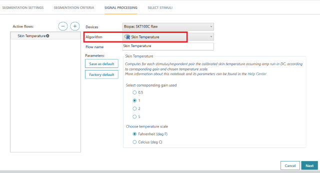

```{r, include = FALSE}
knitr::opts_chunk$set(
  collapse = TRUE,
  comment = "#>"
)
```


# Article 1: How R Notebooks Run in iMotions - An Example Notebook Explained

This article will use Skin Temperature R Notebook as an example, to explain the basics of how R Notebooks run in the 
iMotions platform, read user input parameters and generate results. The full notebook script can be found [here](https://github.com/imotions/R-library/blob/main/imotionsApi/example-notebooks/SkinTemperature.Rmd).

If you write your own R Notebooks that use the imotionsApi package, please note that imotionsApi is licensed under
[GPL 3.0](https://github.com/imotions/R-library/blob/main/LICENSE).

## 1. Defining metadata

```{yaml, eval=F, echo=T}
title: "Skin Temperature"
description: "Computes absolute skin temperature for each respondent assuming amp run in DC, according to corresponding gain and chosen temperature scale."
helpUrl: https://go.imotions.com/Skin_Temperature
dependencies:
  sensor: "Biopac"
params:
  token: "xxxxx"
  studyId: "xxxxx"
  respondentId: "xxxxx"
  selectedSensorName: ""
  flowName: "xxxxx"
  iMotionsVersion: "xxxxx"
  GainSelection:
   label: "Select corresponding gain used"
   value: "1"
   selected: "1"
   input: select
   choices: ["0.5", "1", "2", "5"]
  TemperatureScaleSelection:
   label: "Choose temperature scale"
   value: "Fahrenheit (deg F)"
   selected: "Fahrenheit (deg F)"
   input: select
   choices: ["Fahrenheit (deg F)", "Celsius (deg C)"]
output:
  html_document:
    df_print: kable
    code_folding: hide
    code_download: true
```

The character string after "title": `title: "Skin Temperature"` defines the notebook's name shown under "Algorithm" when one adds notebook in iMotions desktop.



The character string after "description": `description: "Computes absolute skin temperature for each respondent assuming amp run in DC, according to corresponding gain and chosen temperature scale."` summarizes the notebook's functions shown in iMotions desktop when one adds notebook.


The character string after "sensor" under "dependencies": `sensor: "Biopac"` defines what type of sensors can be used for running this notebook.

Normally a notebook will specify a particular study to work on as part of its code. However we would like the notebook
to be able to run against any study. To achieve this we use the R markdown parameters feature to set the values for
the study the notebook is currently being run for. The system will assign a token, studyId, respondentId in the params
block in the metadata and the notebook will run on the study and respondents that user specified in the UI when
creating analysis. E.g.,

```{eval=F, echo=T}
params:
 token: "1234-5678-9012-3456"
 studyId: "210799d9-5c1e-45e0-aaab-8271e0d2c4aa"
 respondentId: "1000"
```

R code in the rest of the notebook can then access this, E.g., `imotionsApi::imConnection(params$token)`

If your notebook takes additional parameters such as the “TemperatureScale” (Fahrenheit or Celsius)
to use for Skin Temperature conversion, you can also add that to the params block, and the values of
these parameters will be assigned based on the user's choices in the UI. There are in total, five types of
params variables available with iMotions desktop: select, multi-select, checkbox, text and numeric:

"Select" type in R:
```{eval=F, echo=T}
params:
  GainSelection:
   label: "Select corresponding gain used"
   value: "1"
   selected: "1"
   input: select
   choices: ["0.5", "1", "2", "5"]
```


"Multi-Select" type in R:
```{eval=F, echo=T}
params:
 Powerbands:
   label: "Powerbands options"
   value: "Alpha"
   selected: "Alpha"
   input: select
   choices: ["Delta", "Theta", "Alpha", "Beta", "Gamma"]
   multiple: yes
```


"Checkbox" type in R:
```{eval=F, echo=T}
params:
  Autoflip: 
   label: "Check the polarity of the signal and flip it if necessary"
   value: FALSE
   input: checkbox
```


"Text" type in R:
```{eval=F, echo=T}
params:
 refChannel1:
   label: "Reference channel 1"
   value: "Ref"
   input: text
```


"Numeric" type in R:
```{eval=F, echo=T}
params:
 extremethr:
   label: "Artefact threshold [in μV]"
   value: 120
   input: numeric
   min: 0
```


Please note that the new R library will apply the computation on study level: when you load a signal,
it will be retrieved for the entire duration of the study recording i.e., for all the stimuli.

## 2. Defining global options: packages loading

```{r, eval=F, echo=T}
library(imotionsData)
library(data.table)
library(dplyr)
library(kableExtra)
library(knitr)
```

Load the packages needed for the notebook running. iMotions already has the iMotions R library and various third-party
packages needed for released notebooks installed. If you install other packages as part of the code in your notebook, 
they will not work in iMotions desktop since they need to be installed from iMotions side. You can find all iMotions installed packages from here: `C:\Program Files\iMotions\Lab_XG\R\library`.

imotionsApi is an iMotions proprietary package that provides functions to access your iMotions studies. Please refer to
here for an overview of available functions and detailed descriptions or type ?imotionsApi in the RStudio console

## 3. Retrieving parameters

```{r, eval=F, echo=T}
# Retrieves parameters
selectedSensorName <- params$selectedSensorName
gain <- as.numeric(params$GainSelection)
temp_scale <- params$TemperatureScaleSelection
```


## 4. Defining functions

```{r, eval=F, echo=T}
#' Retrieving skin temperature datasample
#'
#' @param study An imStudy object as returned from \code{\link{imotionsApi::imStudy}}.
#' @param respondent An imRespondent object as returned from \code{\link{imotionsApi::getRespondents}}.
#' @param selectedSensorName selectedSensorName from software dropdown - cloud value is empty and we use autodetection
#'
#' @details Supports Biopac
#'
#' @return A data.table containing the requested skin temperature data for a given respondent
getSkintempSample <- function(study, respondent, selectedSensorName) {
    # Retrieves all sensors for a respondent of interest
    rSensors <- getRespondentSensors(study, respondent)
    rSensors <- rSensors[!sensor == "R Analysis" & eventSourceType == "Sensor", ]

    # in case of empty selectedSensorName (cloud data), the function will autodetect it
    sensorSensor <- unlist(strsplit(selectedSensorName, "||", fixed = T))[1]
    sensorName <- unlist(strsplit(selectedSensorName, "||", fixed = T))[2]
    sensorInstance <<- unlist(strsplit(selectedSensorName, "||", fixed = T))[3]

    if ((!is.na(sensorSensor) & sensorSensor == "Biopac") || (is.na(sensorSensor) && "Biopac" %in% rSamples$sensor)) {
        message("Biopac Sensor identified.")
        tempSampleIdx <- grepl("SKT100C", rSensors$instance) & grepl("Biopac", rSensors$sensor)
        instanceIdx <- sensorInstance == rSensors$instance

        # if the instance name match a skin temperature data we use this one, else we select the first device found
        if (sum(tempSampleIdx & instanceIdx, na.rm = T) == 1) {
            tempSampleIdx <- tempSampleIdx & instanceIdx
        }

        if (sum(tempSampleIdx) == 0) {
            message("Skin temperature sample not found.")
            return(NULL)
        }

        if (sum(tempSampleIdx) > 1) {
            infoMessage("More than one Biopac device is present. Using the first one.")
        }

        # Retrieves the name of the wanted signal
        sensor <- rSensors[tempSampleIdx, ][1, ]
        signalNames <- sensor$signals[[1]]
        signalName <- signalNames[grepl("Raw", signalNames)]
        
        if (!signalName %in% signalNames) {
            message("The skin temperature signal was not found.")
            return(NULL)
        }

        # Retrieves data for respondent, containing the Timestamp and Signal column
        Temp_Raw <- getSensorData(study, sensor, signalName)
    }

    # Renames the Signal column to Volt
    names(Temp_Raw)[2] <- "Volt"
    return(Temp_Raw)
}
```

Define the function to retrieve skin temperature data samples for given study and respondents from iMotions.


## 5. Connecting to iMotions

```{r, eval=F, echo=T}
studyId <- params$studyId
respondentId <- params$respondentId

### Connect to iMotions and retrieve informations
connection <- imConnection(params$token)
study <- imStudy(connection, studyId)
respondent <- getRespondent(study, respondentId)

studyName <- study$name
respondentName <- respondent$name
```

Establish connection to iMotions API and retrieve study/analysis information (stimuli, respondents and more) by calling
functions provided by `imotionsApi`.

## 6. Executing algorithms


```{r, eval=F, echo=T}
# Extracting data sample
Temp_signal <- getSkintempSample(study, respondent, selectedSensorName)

# Converts to Fahrenheit and adjusting with corresponding gain
Temp_signal$Volt <- (Temp_signal$Volt * gain) + 90

# Converts to Celsius if it is chosen, otherwise proceeded with Fahrenheit
# Columns are furthermore renamed according to chosen temperature scale 
if (temp_scale == "Celsius (deg C)") {
    colname <- "Skin Temperature (deg C)"
    Temp_signal$Volt <- (Temp_signal$Volt - 30) / 2
} else {
    colname <- "Skin Temperature (deg F)"
}

setnames(Temp_signal, "Volt", colname)
```

The algorithms (here it’s converting raw data to temperature) are executed and results are generated.


## 7. Uploading results to iMotions for display


```{r, eval=F, echo=T}
# Creates metadata for appropriate grouping of the signal
group <- c("", "Skin Temperature")
metadata <- data.table("Provided By" = "iMotions", "Group" = group)

# Uploading the converted signals
ul_temp_signal <- uploadSensorData(params, study, Temp_signal, respondent, "Absolute Skin Temperature",
                                   scriptName = "Skin-Temperature", metadata)
```

After processing, upload either signals (with a Timestamp column) or metrics
(single values, with no Timestamp) to iMotions by calling the function `uploadSensorData`
provided by `imotionsApi`. The data then can be viewed and exported locally through the iMotions Desktop software.


## 8. Generating report

When the notebook is knitted, an HTML file (report) will be generated with specific values for parameters that the user
specified when creating analysis in iMotions. The report normally includes study/analysis information, graphs/tables, algorithm
descriptions and embedded R codes. In this example, the first part specifies study related information
(study, respondent, sensor etc.) and is followed by algorithm descriptions.


## 9. Dropping the R file in the right path

The properly functioning .Rmd file needs to be put in the path `C:\Users\[username]\Documents\iMotions\RNotebooks` or 
for export files `C:\Users\[username]\Documents\iMotions\RNotebooks\Exports`, in order to be able to run in iMotions desktop. 
You may need to create the folders called `RNotebooks` or `Exports` yourself if they don't exist. 
Please be aware that there could be repeated notebooks with the same name shown in iMotions, after your editing.
We recommend that you change a notebook's title, when you edit it.
