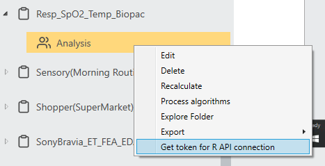

```{r, include = FALSE}
knitr::opts_chunk$set(
  collapse = TRUE,
  comment = "#>"
)
```

# Article 2: How to Access iMotions Data from RStudio

This article will explain when you run analysis in RStudio, how one can access study data that has been finished
collecting in iMotions. The retrieved data can be further analyzed, visualized, exported from RStudio to further fulfill 
your research purposes. It is recommended to read [this article](https://htmlpreview.github.io/?https://github.com/imotions/R-library/blob/main/documentation/article1-example-notebook-explained.html) first to gain an overview of how R Notebook is composed 
and runs in iMotions.

The study “Resp_SpO2_Temp_Biopac” with collected raw skin temperature data and the Skin Temperature R Notebook will be 
used as an example - Let’s imagine you finished data collection in iMotions and now want to access those collected skin 
temperature data from RStudio:


The full Skin Temperature R Notebook script is uploaded [here](https://github.com/imotions/R-library/blob/main/imotionsApi/example-notebooks/SkinTemperature.Rmd).
The iMotions study link is at the bottom of [this article](https://help.imotions.com/hc/en-us/articles/4405330087442) (For signed in users only).

## 1. Load the imotionsApi package

In RStudio, give the command: `library(imotionsApi)`.

`imotionsApi` is an iMotions proprietary package that provides functions to access your iMotions studies. Please refer to
[here](https://raw.githubusercontent.com/imotions/R-library/main/documentation/imotionsApi_2.1.2.pdf) for an overview of available functions and detailed descriptions or type ?imotionsApi in the RStudio console. 
Load other packages that you need for your notebook running.

## 2. Token and IDs

Fill in token, studyId, respondentId in the params block in the metadata to set the values for the study, respondent the notebook is currently being run for. E.g., 

```{yaml, eval=F, echo=T}
params:
 token: "xxxxxxxx"
 studyId: "7f4d87c1-add3-462f-b6e0-73c1e11d340e"
 respondentId: "1000"
```

### Value of token 
The token is used for authentication. By default, we use `xxxxxxxx` to access the study level. If you want to access 
from analysis level, find the token by right clicking on the created analysis and clicking “Got token for R API
connection”. Please note that from the analysis level, you will only be able to access respondents, stimulus that are
created under that specific analysis.



Use command in R console to directly define token and pass this variable in the function `imConnection` later: 
`token <- "xxxxxxxx"`.

### Value of studyId and respondentId

To find the studyId and respondentId, first create a connection with the iMotions API with the command:

```{r, eval=F, echo=T}
connection <- imotionsApi::imConnection(token)
```

Then list all available studies you have in iMotions with the command:

```{r, eval=F, echo=T}
imotionsApi::listStudies(connection)
```

A list of studies with their corresponding IDs will be listed, locate the one you need and fill it into `studyId`:


Use command in R console to directly define studyId:

```{r, eval=F, echo=T}
studyId <- "7f4d87c1-add3-462f-b6e0-73c1e11d340e"
```


Then load an iMotions study by studyId. This will retrieve detailed information about a study including stimuli, 
respondents, segments, and more. The returned value is an imStudy object that can be passed to other methods later:

```{r, eval=F, echo=T}
study <- imotionsApi::imStudy(connection, studyId)
```

Then list all available respondents of that study in iMotions with the command:

```{r, eval=F, echo=T}
imotionsApi::getRespondents(study)
```

A list of respondents with their corresponding IDs will be listed, locate the one you need and fill it into 
`respondentId`.

Use command in R console to directly define `respondentId`:

```{r, eval=F, echo=T}
respondentId <- "b5c4abef-7856-4a08-ac4a-6922dda6b674"
```

Last, get information of a specific respondent by `respondentId`:

```{r, eval=F, echo=T}
respondent <-  imotionsApi::getRespondent(study, respondentId)
```


## 3. Retrieving iMotions data by study and respondent

First retrieves all sensors information for a respondent of interest with the command:


```{r, eval=F, echo=T}
rSensors <-  imotionsApi::getRespondentSensors(study, respondent)[!sensor == "R Analysis" & eventSourceType == "Sensor", ]
```

In this example, the 4th row’s sensor information is what we want to extract from the returned rSensors:


We extract the 4th row by columns “sensor” (a value given by iMotions based on what sensor you connected. In this
example, it’s “Biopac”) and “instance” (a device name given by users. In this example, it’s “SKT100C”):

```{r, eval=F, echo=T}
tempSampleIdx <- grepl("SKT100C", rSensors$instance) & grepl("Biopac", rSensors$sensor)
sensor <- rSensors[tempSampleIdx, ][1, ]
```

The returned sensor contains all information of the sensor that our wanted signal (raw skin temperature) belongs to:


Next, we retrieve the name of our wanted signal with commands:


```{r, eval=F, echo=T}
signalNames <- sensor$signals[[1]]
signalName <- signalNames[grepl("Raw", signalNames)]
```

In this example, the returned signalName is `Channel 2 (Raw)`.

As the last step, we retrieve the wanted signal for a given respondent by study, sensor and signalName:

```{r, eval=F, echo=T}
Temp_Raw <-  imotionsApi::getSensorData(study, sensor, signalName)
```

The returned object “Temp_Raw” contains wanted signal and its corresponding Timestamp, you can do further data extraction and analysis from now on:


## Resources to learn R

- http://arrgh.tim-smith.us/
- https://www.johndcook.com/blog/r_language_for_programmers/
- https://bookdown.org/rdpeng/RProgDA/
- http://adv-r.had.co.nz/
